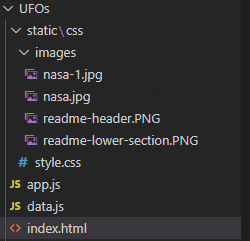
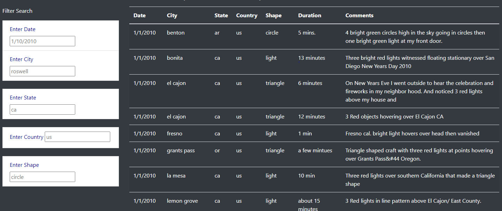

## Overview of the Project

Explain the purpose of this analysis.

There is a compilation of data containing UFO data including the Date seen, City, Country, Shape and Duration. Some of the observations on the type of UFO are also collated under the Comments section. This project provides users a web interface to look up the UFO data based on different selection criteria of the UFO sightings. It incorporates Javascript to pull in all the data available in JSON format and render it in an HTM format based on the selection criteria.

Code and data is organized as:

## Results

Describe to Dana how someone might use the new webpage by walking her through the process of using the search criteria. Use images of your webpage during the filtering process to support your explanation.

Once hosted, the UFO website will be available at ***https://<TBD/UFOs/index.html***. On initial access, the user will be provided with a title and short description with a perspective on UFO sightings

In the second half of the page the listings of all the UFOs are displayed. On the left side filters are provided to the users to narrow down the search based on the filers criteria. The display is dynamic and results corresponding to the criteria specified are displayed immediately.

## 

## Summary

In a summary statement, describe one drawback of this new design and two recommendations for further development.

### Drawback

The user has to first observe the results and then formulate the search strings. The search values are not intuitive. For example, shapes like "Triangle" or "light" are not easily known

The user must be guided through the use of pull down selection menus and date pickers (calendar type widgets).

### Recommendations

1. The filter for "Enter Country" should have a "Country Based pull down menu". The user should be able to select the country(s) for the search parameter to the filter.
2. The filter for the Shaped should have a pull down "Shapes Available" menu. This should be assembled in the code itself so all the shapes of the UFO sightings should be available in this dynamic pull-down menu
3. The filer for the dates should have a calendar widget or a collection of dates currently available in the UFO data set. It should be pre-compiled.

